Text & Geospatial Visualization
================
Ningyin Xu
5/15/2018

### Introduction

In this assignment, I look at 2 recent hot topics/hashtags on Twitter: **\#MeToo** and **\#MorganFreeman**. Over the past year, more than 200 powerful people - celebrities, politicians, CEOs and others - have been the subject of sexual harassment or assault allegations. Since the case of Havey Weinstein, **\#MeToo movement** has gained more and more awareness and support from all over the country. Women are inspired to share their experiences with harassment and assault under the hashtag **\#MeToo**. And the most recent allegations of sexual harassment from Morgan Freeman has brought more attention on the issue, and has also brought **\#MorganFreeman** to the top of the trending hashtags.

Using text visualization and geospatial techniques, I intend to look at: What people are talking about when they're tweeting about **\#MeToo** and **\#MorganFreeman**?

### Tokenized Words

I obtained 3376 tweets for **\#MorganFreeman** and 9807 tweets for **\#Metoo**. Here we can look at the wordcloud from these tweets.

I mainly used **wordcloud** for the purpose, since it provides an impression on what words are mostly used from a long string (in this case, large amount of tweets). I also tried using barplot, however, when the number of word gets past 20, barplots are hard to inspect. In this task, we would like to see many words instead of only 20, thus barplots, or other traditional plots for frequency, are not a good choice. For each wordcloud, I included at least 100 words, and 200-300 words for **\#MeToo**.

Another feature I like about **wordcloud** is *comparison cloud* and *commality cloud*. These allow us to compare the most frequent words from 2 topics more easily.

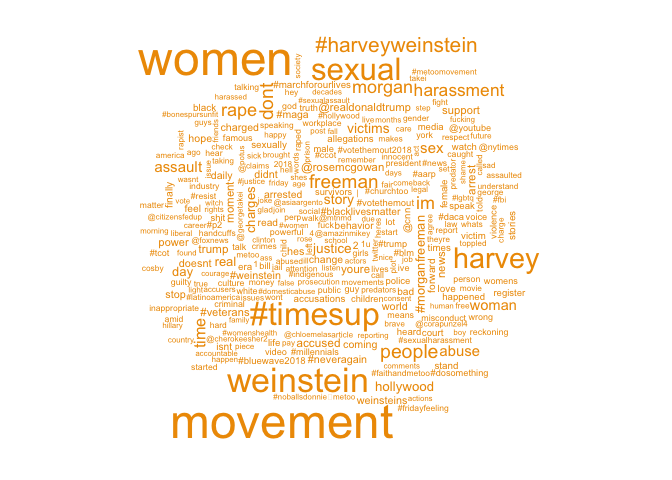

From the above wordcloud for **\#MeToo**, one can see the most frequently mentioned words are: Harvey Weinstein, Morgan Freeman, and Timesup (another movement against sexual harassment, founded by Hollywood celebrities). And other noticeable words include: harassment, hollywood, story, trump, support, justice, rape etc.

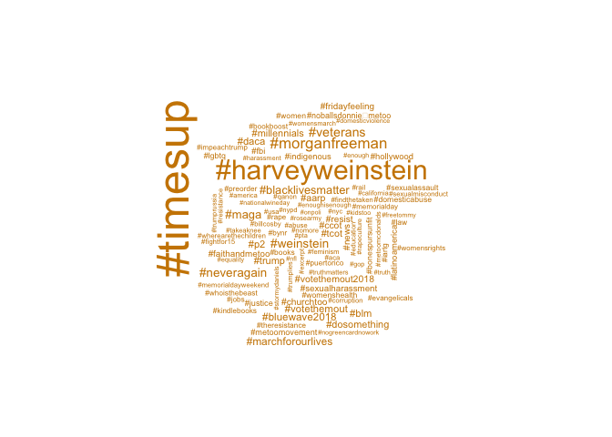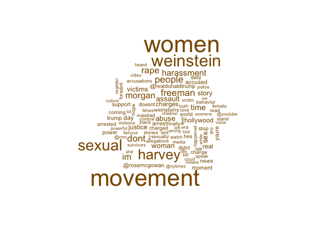

To have a better understanding, I further break the wordcloud down to "hashtags" and "other". For hashtags, "\#timesup" is highly correlated with \#MeToo. However, "\#veterans" and "\#memorialdayweekend" also showed up in the wordcloud, suggesting the date we scraped the data can influence the results we got. Other hashtags include: "\#neveragain", "\#blacklivesmatter", which are hot topics in gun control and movement against violence and systemic racism. The variety in the hashtags may suggest the relationship between these topics, or intention of raising awareness of these tweets. For contents other than "hashtags", "havey weinstein", "morgan freeman", "women", "sexual", "dont", "rape" are some most frequent words. These suggest the content of these tweets are mostly focused on sexual harassment towards women, which is as expected.

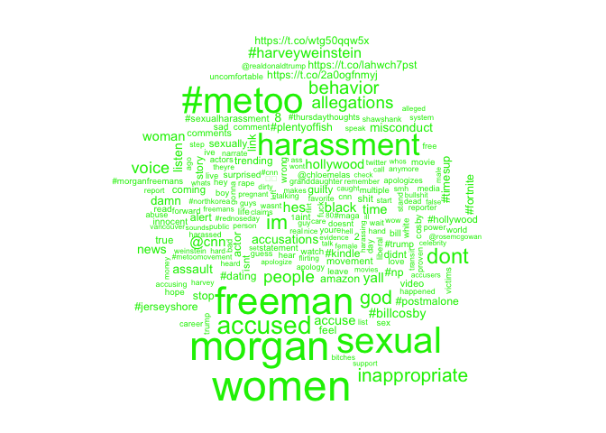

I did similar operations on **\#Freeman** tweets. We can see the contents are more specific to the freeman scandal. Aside from words involving sexual harassment on women, there are also some links, news network "cnn", and some curse words. In addition, "Bill Cosby" is more correlated to this topic, than to the "\#MeToo" topic. This is as expected due to the careers and races of the two.

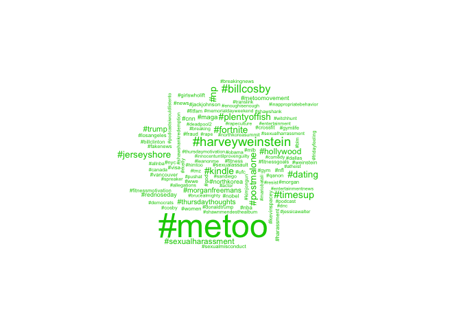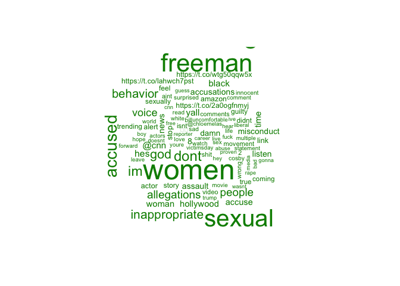

For relative hashtags, we can see more recent events: nba, deatpool2 etc. And other celebrities claimed that have done sexual harassments: like Kevin Spacey. Ohter than hashtags, "accused", "sexual", "women" are mentioned more often, which mostly focused on the sexual harassment news. We also see more emotional words or curse words, which shows public reaction to this news. The word "god" are also mentioned very frequently, this could be people expressing their surprise, or due to the fact that Morgan Freeman played god in several famous movies.

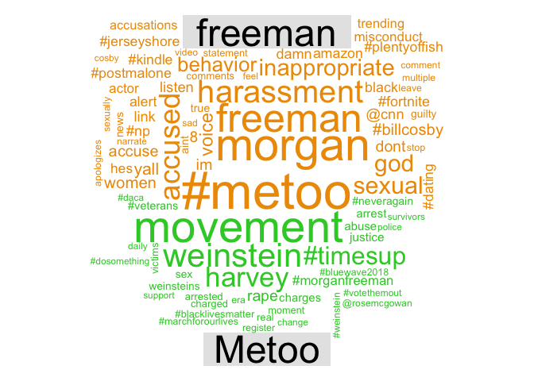

Then we compare these two topics. The above **comparison cloud** gave us a general idea: in "\#Metoo", other heated topics are more likely to appear, while for "\#MorganFreeman" there are words more involved with the specific news.

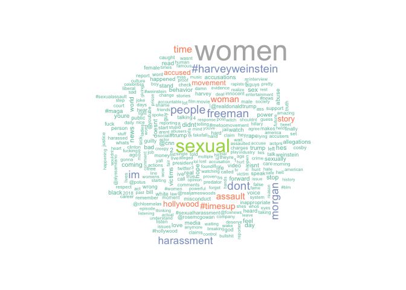

Looking at **commonality cloud**, we can see these two topics are both heavily focused on sexual harassment issues.

### Time Series

I'm also interested in the topic development of these 2 topics. When do people start talking about these topics? And at what time they tweet about them the most?

I utilized line plot for time series data. This is best matched with the characteristic of time series data. And I used 3-hour interval for time duration. This is a tuned parameter based on the data I got: for data of 5 and 10 days, 40 and 80 data points are easy enough to observe the values.

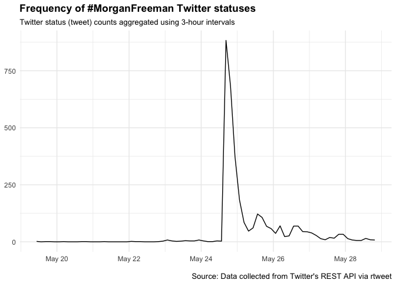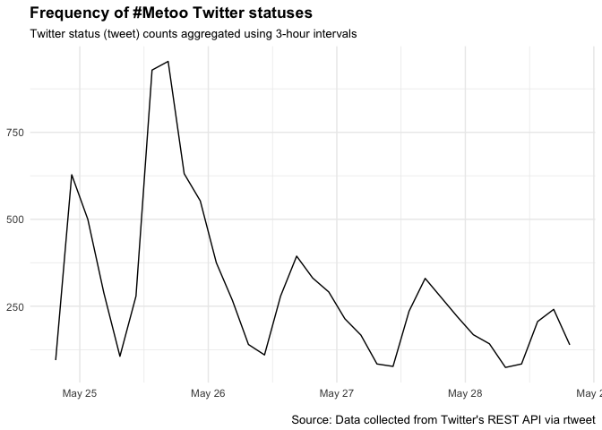

**\#MorganFreeman** shows a breakout near May 25th, which is when the news got out. However **\#MeToo** shows a peak everyday around 3 to 6pm, except the breakout of Freeman scandal. This corresponds with people's habit in tweeting in daytime.

### Geospatial

Finally, let's look at the geolocation of the tweets. This is presented by US maps and tweet coordinate points layered on top of it.

I chose to display city labels with population size larger than 700,000. This gives reader a comparison between the density of population and density of tweets. One can tell from the graph, most tweets come from big cities.

And one can see due to the data size, there are more **\#MeToo** tweets than **\#MorganFreeman** tweets. Interestingly, **\#MorganFreeman** tweets are more likely to be found in California, near Hollywood.

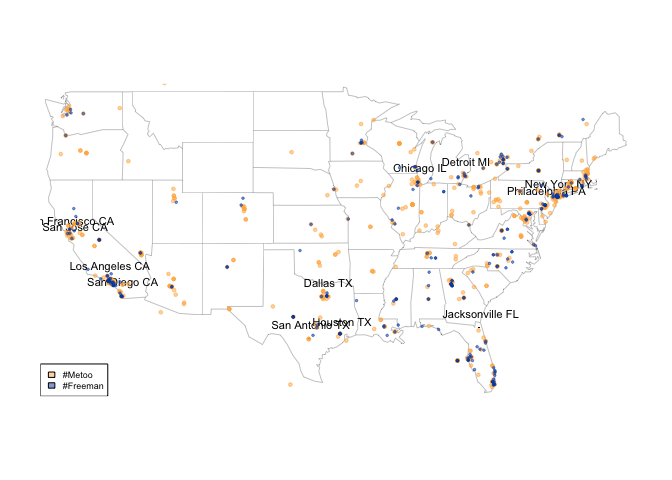
